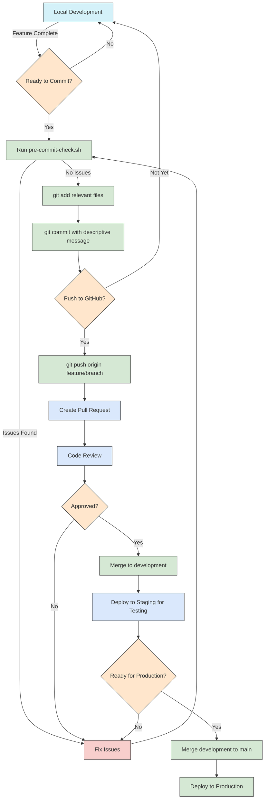

```mermaid
graph TD
    A[Local Development] -->|Feature Complete| B{Ready to Commit?}
    B -->|Yes| C[Run pre-commit-check.sh]
    B -->|No| A
    C -->|Issues Found| D[Fix Issues]
    D --> C
    C -->|No Issues| E[git add relevant files]
    E --> F[git commit with descriptive message]
    F --> G{Push to GitHub?}
    G -->|Yes| H[git push origin feature/branch]
    G -->|Not Yet| A
    H --> I[Create Pull Request]
    I --> J[Code Review]
    J --> K{Approved?}
    K -->|Yes| L[Merge to development]
    K -->|No| D
    L --> M[Deploy to Staging for Testing]
    M --> N{Ready for Production?}
    N -->|Yes| O[Merge development to main]
    N -->|No| D
    O --> P[Deploy to Production]
    
    style A fill:#d4f1f9,stroke:#333,stroke-width:1px
    style B fill:#ffe6cc,stroke:#333,stroke-width:1px
    style C fill:#d5e8d4,stroke:#333,stroke-width:1px
    style D fill:#f8cecc,stroke:#333,stroke-width:1px
    style E fill:#d5e8d4,stroke:#333,stroke-width:1px
    style F fill:#d5e8d4,stroke:#333,stroke-width:1px
    style G fill:#ffe6cc,stroke:#333,stroke-width:1px
    style H fill:#d5e8d4,stroke:#333,stroke-width:1px
    style I fill:#dae8fc,stroke:#333,stroke-width:1px
    style J fill:#dae8fc,stroke:#333,stroke-width:1px
    style K fill:#ffe6cc,stroke:#333,stroke-width:1px
    style L fill:#d5e8d4,stroke:#333,stroke-width:1px
    style M fill:#dae8fc,stroke:#333,stroke-width:1px
    style N fill:#ffe6cc,stroke:#333,stroke-width:1px
    style O fill:#d5e8d4,stroke:#333,stroke-width:1px
    style P fill:#d5e8d4,stroke:#333,stroke-width:1px
```
